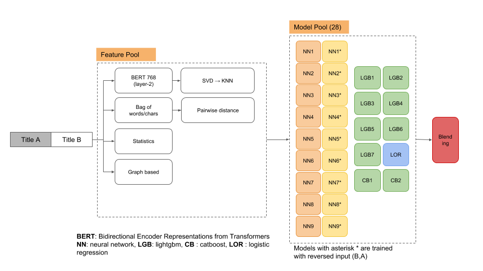

# WSDM Cup 2019: ByteDance - Fake News Classification

This repository contains source code for 1st place submission at the WSDM cup 2019, task 1.

http://www.wsdm-conference.org/2019/wsdm-cup-2019.php



### Problem

ByteDance is a China-based global Internet technology company. Their goal is to build a global content platform that enables people to enjoy various content in different forms, with an emphasis on informing, entertaining, and inspiring people across language, culture, and geography. One of the challenges ByteDance faces is to combat different types of fake news, here referring to all forms of false, inaccurate, or misleading information. As a result, ByteDance has created a large database of fake news articles, and any new article must go through a test for content truthfulness before being published, based on matching between the new article and the articles in the database. Articles identified as containing fake news are then withdrawn after human verification of their status. The accuracy and efficiency of the process, therefore, are crucial in regard to making the platform safe, reliable, and healthy. ByteDance invites researchers and students in the community to take part in the following task. Given the title of a fake news article A and the title of a coming news article B, participants are asked to classify whether B may contain fake news.

### System requirements

Our system specification to make predictions for the WSDM cup 2019.

```
HDD 120 GB+, CPU 64 cores, RAM 512GB, 8 GPU GTX 1080 Ti

```


### Software requirements

```

OS Ubuntu LTS 16.04 with anaconda.
We use catboost and lightgbm for tree based models, tensorflow GPU for nnets, sklearn for metrics, cross validation, logistic regression.

# packages in environment at /userhome/anaconda3/envs/lp:
#
# Name                    Version                   Build  Channel
catboost                  0.11.1                    <pip>
Distance                  0.1.3                     <pip>
fuzzywuzzy                0.16.0                    <pip>
jieba                     0.39                      <pip>
lightgbm                  2.1.2                     <pip>
multiprocess              0.70.5                    <pip>
networkx                  2.1                      py36_0
numpy                     1.14.5           py36hcd700cb_0
numpy-base                1.14.5           py36hdbf6ddf_0
pandas                    0.23.1           py36h637b7d7_0
python                    3.6.5                hc3d631a_2
python-dateutil           2.7.3                    py36_0
python-Levenshtein        0.12.0                    <pip>
scikit-learn              0.19.1           py36h7aa7ec6_0
scipy                     1.1.0            py36hfc37229_0
seaborn                   0.8.1            py36hfad7ec4_0
statsmodels               0.9.0            py36h3010b51_0
tensorflow                1.8.0                hb11d968_0
tensorflow-base           1.8.0            py36hc1a7637_0
tensorflow-gpu            1.8.0                h7b35bdc_0
tensorflow-gpu            1.12.0                    <pip>
tensorflow-gpu-base       1.7.0            py36hcdda91b_1

```


### Folder structure

```
.
|-- chinese_L-12_H-768_A-12
|   |-- bert_config.json
|   |-- bert_model.ckpt.data-00000-of-00001
|   |-- bert_model.ckpt.index
|   |-- bert_model.ckpt.meta
|   `-- vocab.txt
|-- data
|   |-- chinese_stop_words.txt
|   |-- test.csv
|   `-- train.csv
|-- LICENSE
|-- log
|-- output
|-- README.md
|-- requirements.txt
|-- solution
|   |-- consolidate_nnet_results.sh
|   |-- create_pretraining_data.py
|   |-- extract_features_wsdm.py
|   |-- __init__.py
|   |-- make_bert768_svd_knn_31_features.py
|   |-- make_bert_pair_encoding_768.sh
|   |-- make_concatenate_64_features.py
|   |-- make_ensembling.py
|   |-- make_handcrafted_33_features.py
|   |-- make_knn_feats.py
|   |-- make_manual_64_features.sh
|   |-- make_solution_single_gpu.sh
|   |-- modeling.py
|   |-- optimization.py
|   |-- run_classifier.py
|   |-- run_classifier_v2.py
|   |-- run_classifier_v3.py
|   |-- tokenization.py
|   |-- train_predict_nnets_batch1.sh
|   |-- train_predict_nnets_batch2.sh
|   |-- train_predict_nnets_batch3.sh
|   |-- train_predict_trees_batch1.py
|   |-- train_predict_trees_batch2.py
|   `-- train_predict_trees_batch3.py
`-- sub

```

### Input

Please copy/download train.csv, test.csv into **data** folder.

### Pretrained

``` 

1. download Chinese Simplified and Traditional, 12-layer, 768-hidden, 12-heads, 110M parameters: wget https://storage.googleapis.com/bert_models/2018_11_03/chinese_L-12_H-768_A-12.zip
2. unzip in root folder, say wsdm19cup: unzip 
3. download list of stopword in Chinese: https://github.com/Tony607/Chinese_sentiment_analysis/blob/master/data/chinese_stop_words.txt into **data** folder

```

### Usage

Before training and making prediciton, please ensure the data, chinese pretrained embedding are set up correctly as follows:

```
. 
|-- chinese_L-12_H-768_A-12
|   |-- bert_config.json
|   |-- bert_model.ckpt.data-00000-of-00001
|   |-- bert_model.ckpt.index
|   |-- bert_model.ckpt.meta
|   `-- vocab.txt
|-- data
|   |-- chinese_stop_words.txt
|   |-- test.csv
|   `-- train.csv

```

Please install required packages above.

Go to **solution** folder and run scripts below.

```
cd solution

```

#### Single GPU environment

In case you have a single GPU, please run this script. It is time consuming as running in sequential steps.

```
sh make_solution_single_gpu.sh

```

#### Multiple GPU environment(recommended)

**Bert encoding 768 dimension**

To extract bert 768-d encoding for pair news, run this script. Please specify the **GPU devices** using **CUDA_VISIBLE_DEVICES** variable if you have multiple GPU cards. If you have single GPU, please go to single GPU version

```
sh make_bert_pair_encoding_768.sh

```

**Handcrafted 64 features**

```
sh make_manual_64_features.sh

```

**Tree based models**

To train and predict using tree-based models, the snippet is:

```

python train_predict_trees_batch1.py

python train_predict_trees_batch2.py

python train_predict_trees_batch3.py

```

**Nnet based models**

To train and predict using nnet models, follow thess steps

```

sh train_predict_nnets_batch1.sh

sh train_predict_nnets_batch2.sh

sh train_predict_nnets_batch3.sh

```

**To check the results**


There are 18 output folders of nnets, to ensure the modeling is proper please check the existence of **test_results.tsv** file in each folder.
For instance, the correct one is:

```
.
|-- output_2e5_3epo_156ml
|   |-- checkpoint
|   |-- events.out.tfevents.1545651815.ISO-DP-GPU-21
|   |-- graph.pbtxt
|   |-- model.ckpt-27000.data-00000-of-00001
|   |-- model.ckpt-27000.index
|   |-- model.ckpt-27000.meta
|   |-- model.ckpt-28000.data-00000-of-00001
|   |-- model.ckpt-28000.index
|   |-- model.ckpt-28000.meta
|   |-- model.ckpt-29000.data-00000-of-00001
|   |-- model.ckpt-29000.index
|   |-- model.ckpt-29000.meta
|   |-- model.ckpt-30000.data-00000-of-00001
|   |-- model.ckpt-30000.index
|   |-- model.ckpt-30000.meta
|   |-- model.ckpt-30051.data-00000-of-00001
|   |-- model.ckpt-30051.index
|   |-- model.ckpt-30051.meta
|   |-- predict.tf_record
|   |-- test_results.tsv
|   `-- train.tf_record

```

**To consolidate nnets results**

```
sh consolidate_nnet_results.sh

```

**To make final ensembling**

```
python make_ensembling.py

```

Finally please submit the final_score.csv in **sub** folder to reproduce this solution (1st place, private/public score ~ 0.88287/0.88199)


(For further information or inqueries, please contact me, Lam P laampt@gmail.com)

### Citations and References

The code is incorporated from Google Bert (big thank to Google AI team), some features inherited from Kaggle Quora Question Pair Matching

1. https://github.com/google-research/bert#pre-trained-models
2. https://www.kaggle.com/c/quora-question-pairs

```
@article{devlin2018bert,
  title={BERT: Pre-training of Deep Bidirectional Transformers for Language Understanding},
  author={Devlin, Jacob and Chang, Ming-Wei and Lee, Kenton and Toutanova, Kristina},
  journal={arXiv preprint arXiv:1810.04805},
  year={2018}
}

```
